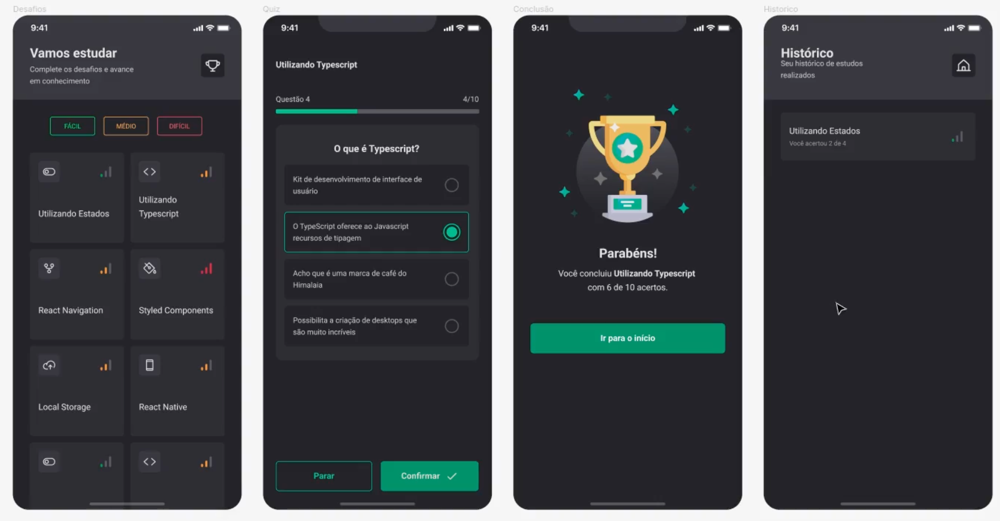

# :bulb: IgniteQuiz

>  Uma aplicação de QUIZ com foco no desenvolvimento de animações, microinterações e feedbacks visuais, táteis e sonoros.

## :mag: Visão Geral

O IgniteQuiz é um projeto desenvolvido como parte do curso Ignite da Rocketseat, com o objetivo de explorar conceitos avançados de animações e interações no desenvolvimento de aplicativos utilizando React Native e Expo.

## :rocket: Funcionalidades

- Exibição de perguntas e opções de respostas em um formato de Quiz interativo.
- Feedback visual, tátil e sonoro ao responder cada pergunta.
- Integração com fontes do Google para estilização dos textos.
- Utilização de componentes e recursos avançados do React Native e Expo.

## :computer: Requisitos do Sistema

- Node.js (v14 ou superior)
- Expo CLI (instalado globalmente)

## :arrow_down: Instalação

1. Clone o repositório:

```bash
git clone https://github.com/Pedrowesley/ignite-rn-06-ignite-quiz-main.git
```

2. Navegue para a pasta do projeto:

```bash
cd ignite-rn-06-ignite-quiz-main
```

3. Instale as dependências:

```bash
npm install
```

ou

```bash
yarn install
```

## :rocket: Executando o Projeto

Para executar o projeto, utilize um dos seguintes comandos:

- Para iniciar a versão web:

```bash
npm run web
```

ou

```bash
yarn web
```

- Para iniciar a versão no emulador Android:

```bash
npm run android
```

ou

```bash
yarn android
```

- Para iniciar a versão no emulador iOS:

```bash
npm run ios
```

ou

```bash
yarn ios
```

## :wrench: Tecnologias Utilizadas

- React Native
- Expo
- React Navigation
- React Native SVG
- Expo AV (Audio/Video)
- Expo Haptics (Feedback tátil)
- Outras dependências listadas no `package.json`

## :handshake: Contribuição

Contribuições são bem-vindas! Se você encontrou algum bug ou tem alguma melhoria para sugerir, por favor, abra uma nova "Issue" ou envie um "Pull Request".

## :scroll: Licença

Este projeto está licenciado sob a [MIT License](https://opensource.org/licenses/MIT).

## :camera_flash: Imagem


